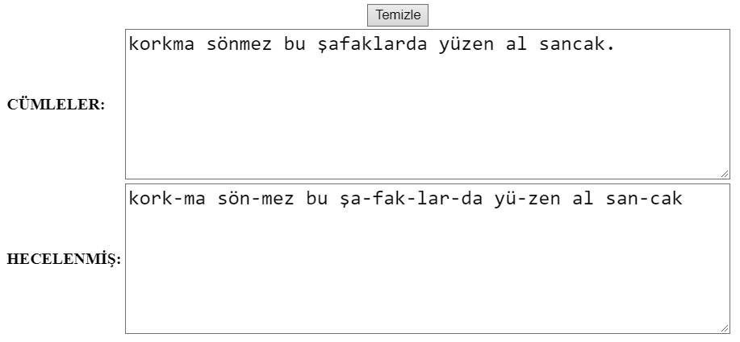

# Syllabify Turkish / Türkçe'yi Hecele
:point_right: [Readme in English](README_EN.md)

Türkçe'yi hecelerine ayıran basit bir JavaScript programı.
[Bu linki](https://raw.githack.com/opethef10/Syllabify-Turkish/main/syllabifyTurkish.html) for kullanarak deneyebilirsiniz.

## Nasıl Çalışır?

### Heceleme Kuralları
Türkçe'yi heceleme kuralları oldukça basittir.  
- Her hecede sadece bir ünlü bulunur.  
- Ünsüzler hecedeki tek ünlüyü şu şekillerde çevreleyebilir: (C herhangi bir ünsüzü, V herhangi bir ünlüyü temsil eder.)
    - Türk kökenli sözcüklerde hecenin yapısı şu şekillerde olabilir: **(C)V(C)(C)**
    - Örnekler: 
        - a
        - da
        - dar
        - darp 
        - ar
        - arp
     - Ancak yabancı dillerden alınma sözcüklerde sözcük başında ve/veya sonunda birden fazla ünsüzün gelmesi olanaklıdır.
     - Örnekler:
        - star
        - start
        - tart
        - sfenks
        - stres
     - Türkçe hecelemenin doğası gereği, gerçek hayatta kullanılması olanaksız bazı sözcükler de algoritma tarafından kabul edilir:
        - sdfdsgahghdfghg
 - Türkçe sözcükler sonda birden çok ünsüz alabilse de bunun olduğu örnekler çok kısıtlıdır. Çok heceli sözcüklerde hece bölünmeleri şu şekildedir: **C.CV** ya da **V.CV**. **C.V** biçiminde bir bölünmeye izin verilmez, **V.V** bölünmesi de iki ünlünün yan yana geldiği nadir örneklerde görülür.
 - Demek o ki, yan yana gelen iki ünlü olmadığı sürece sonraki hece ünsüzle başlamak zorundadır.
 - Örnekler:
     - ab.la
     - a.li
     - a.it
 - Tek heceli bir sözcük ünlüyle başlayan bir ek aldığında ilk hecenin son ünsüzü, yeni hecenin başına aktarılır.
 - Örnekler:
     - kök + ü ➡️ kö.kü 
     - öz + üm ➡️ ö.züm
     - türk + ü ➡️ tür.kü
     - sfenks + e ➡️ sfenk.se

### Algoritma
Yukardaki kurallara dayanarak, Türkçe heceleme kuralını tek düzenli ifadede tanımlayabiliriz: 
- `(C*VC*?)(C?V.*)` Burdaki C'nin yerine `[bcçdfgğhjklmnprsştvyz]` V'nin yerine de `[aıoueiöü]` gelecek.

Desendeki "?", yan yana iki ünlü olmadığı sürece ikinci hecenin ünsüzle başlamasını garanti eder.
Bu desen sözcüğü iki kısma böler: İlk hece ve sözcüğün gerisi. Ardından algoritma sonlandırma koşuluna (sözcüğün geri kalan kısmında tek ünlü olması) ulaşana dek yinelengen (rekürsif) bir biçimde sözcüğü heceler.

Heceleme fonksiyonunu basitçe şu şekilde oluşturabiliriz:
(Yanlış girdilerin tespiti kod dosyası içerisinde ayrıca eklenmiştir.)
```javascript
const PATTERN = /([bcçdfgğhjklmnprsştvyz]*[aıoueiöü][bcçdfgğhjklmnprsştvyz]*?)([bcçdfgğhjklmnprsştvyz]?[aıoueiöü].*)/

function syllabifyWord(partition){
	if (matched = partition.match(PATTERN))
		return matched[1] + '-' + syllabifyWord(matched[2])
	return partition
}
```

## Görüntüler
Örnek bir cümle olarak İstiklal Marşı'nın ilk dizesi hecelerine ayrılmış bir biçimde gösterilmiştir.

